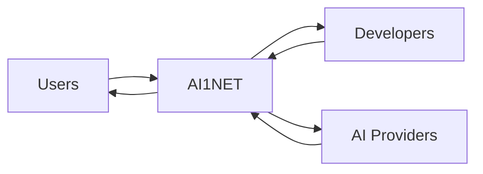

<p align="center">
  
</p>

<div align="center">


### One Network. All AI.


<br/>


</div>

---

## 🧠 WHAT IS AI1NET

```diff
+ A unified layer between users and AI systems
+ Access multiple AI models from one interface
+ Earn while you use AI
+ Build on top of a decentralized AI network
```

---

## 🌐 THE AI NETWORK LAYER

```
   USERS
     ↓
 ┌──────────┐
 │  AI1NET  │   ← Unified Layer
 └──────────┘
     ↓
 AI SYSTEMS
```

```diff
+ One entry point
+ Smart routing
+ Interoperability
+ Scalable infrastructure
```

---

## ⚙️ CORE FEATURES

| Feature              | Description                              |
|---------------------|------------------------------------------|
| 🔗 Multi-Model       | Access multiple AI providers             |
| 🧠 Smart Routing     | Best AI for every request                |
| 💰 Earn Rewards      | Get paid while using AI                  |
| 🧩 Developer SDK     | Build apps on top                        |
| 🌍 Decentralized     | Open & permissionless ecosystem          |

---

## 💰 TOKEN ECONOMY

```
          ┌──────────┐
          │ $AI1NET  │
          └────┬─────┘
               ↓
   ┌───────────┼───────────┐
   ↓           ↓           ↓
 USE        REWARDS      STAKE
   ↓           ↓           ↓
   └──────→ GOVERNANCE ←───┘
```

```diff
+ Pay for AI usage
+ Earn rewards
+ Stake tokens
+ Govern the network
```

---

## 🧩 ECOSYSTEM



---

## 🚀 USE CASES

```diff
+ AI aggregation platform
+ Developer infrastructure
+ AI marketplace
+ Offline-first AI systems
+ Enterprise AI gateway
```

---

## 🛠️ TECH STACK

```
Frontend   → Next.js / Tailwind / UI System  
Backend    → Node / API Layer  
AI Layer   → Multi-model integration  
Infra      → Edge + Cloud + Offline Nodes  
Web3       → Token + Smart Contracts  
```

---

## 🛣️ ROADMAP

```diff
[✓] Phase 1 — AI Aggregator MVP
[ ] Phase 2 — Token Economy
[ ] Phase 3 — Developer Platform
[ ] Phase 4 — Decentralization
[ ] Phase 5 — Global AI Layer
```

---

## 🌍 VISION

> The universal gateway to AI.

```diff
+ Users → access everything
+ Developers → build freely
+ Providers → scale globally
```

---

## 🔗 LINKS

- 🌐 Website: https://ai1net.io  
- 🧪 App: https://app.ai1net.io  
- 📚 Docs: https://docs.ai1net.io  
- 🐦 X: https://x.com/AI1NET  
- 💬 Telegram: https://t.me/AI1NET  

---

## ⚡ BUILDING IN PUBLIC


---

## 🧠 FINAL

```
THIS IS NOT JUST AN APP

THIS IS INFRASTRUCTURE
```

---

<div align="center">

### ⚡ AI1NET

**One Network. All AI.**

</div>
